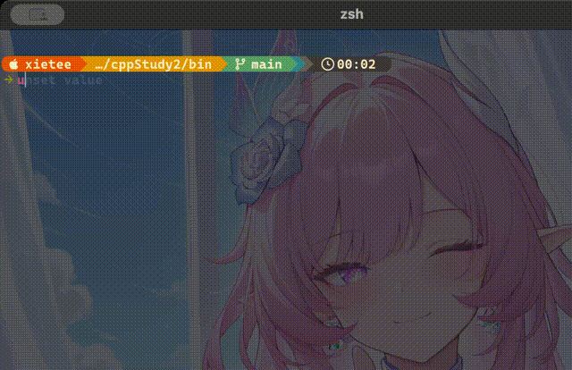

## 用 *C++* 实现的推箱子小游戏
### 这里是我用于学习 *C++* 的一个实践项目，基于 `mac` 平台开发的推箱子小游戏，熟悉并应用这一段时间以来学到的 *C++* 知识，目前正在完善基本功能 

### 现在已实现功能：
#### 游戏实现:
- 用主循环实现闯关机制，用内嵌循环处理游戏主循环
- 玩家可以自己输入数字选择关卡，为了便于开发和调试，目前不采用闯关制
- 用 `Map` 类来处理关卡地图逻辑
- 用 `Player` 类来处理玩家的交互逻辑
- 可以通过输入 `w` `a` `s` `d` 来控制玩家的移动，还可以输入 `q` 来退出游戏，输入 `r` 重开游戏，避免箱子被推到死角导致无法继续游玩
- 用 `Map` 类中的方法 `keyAnalyse` 以及 `executeAnalyse` 充当解析器，解析玩家输入的字符，并用 `vector` 容器来储存解析结果
- 通过简单的 `if` 语句判定 玩家、箱子、障碍物 和 星星(终点) 的交互，并解决简单的边界问题
- 可以输入字符串进行连续移动，并用 `<thread>` 和 `<chrono>` 实现延时运行来展示玩家移动过程
- 利用递归解决箱子碰上另一个箱子的情况
#### 跨平台实现:
- 经测试，该游戏已经可以在 `mac` 和` windows` 平台运行
- 用条件编译实现了不同平台终端的刷新功能
- 由于某些u8字符不能在 `windows` 平台上实现，所以使用条件编译将 `windows` 平台的一些字符做了替换，所以呈现效果可能没有 `mac` 平台的好，但并不影响游戏游玩！
### 游戏实录(mac平台，仅展示 1 至 5 关):

- 这里是 GIF 动图:

> 如果 GIF 无法正常显示，请点击链接查看：
> - [游戏实录 GIF](./media/game-recording.gif)
***
### 注意:
- 该游戏为学习项目，不是正式项目
- 由于还在开发，所以留下了很多调试信息
- 目前该游戏有6个关卡
- 目前正处暑假，更新会跟活跃一点
